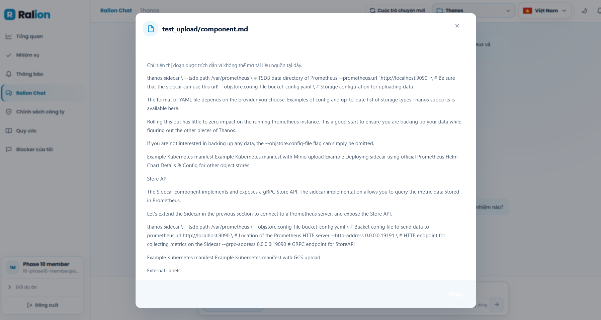
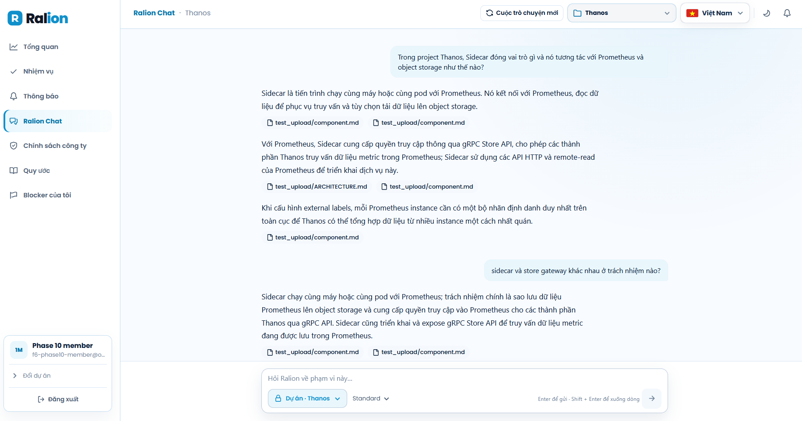
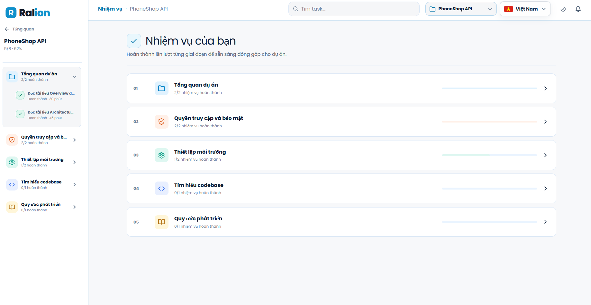
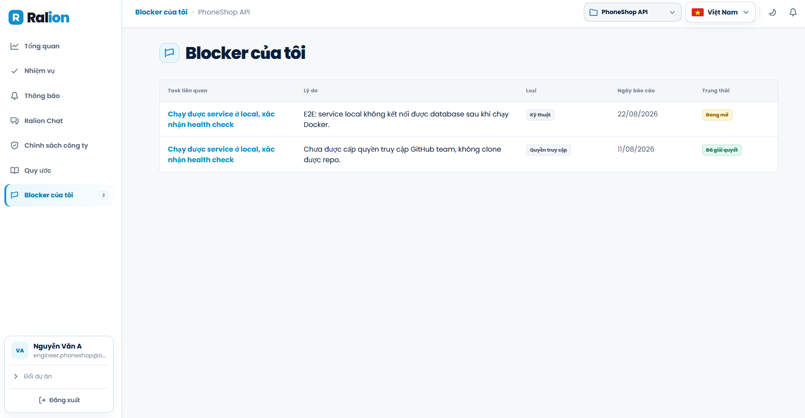
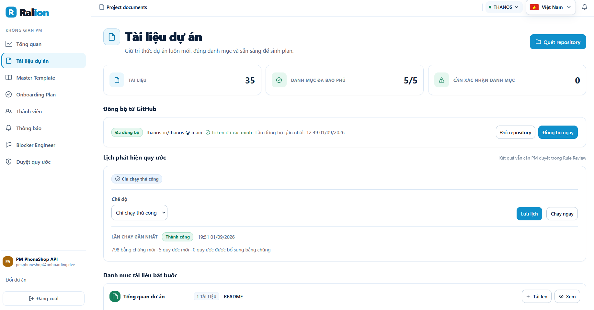
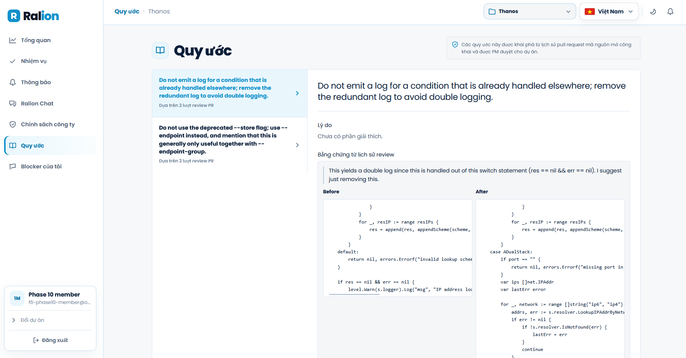
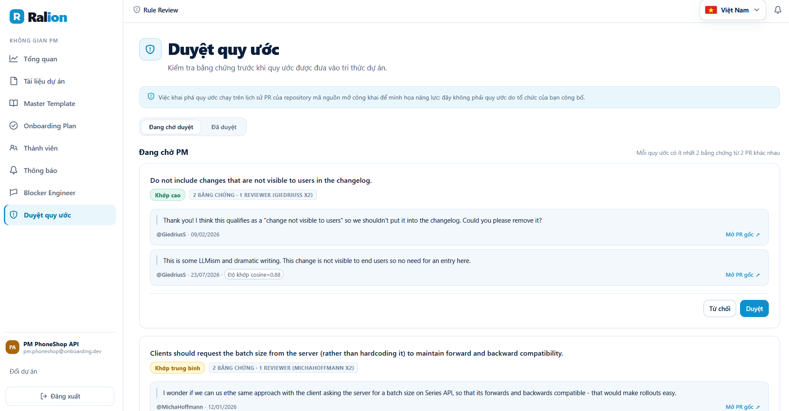
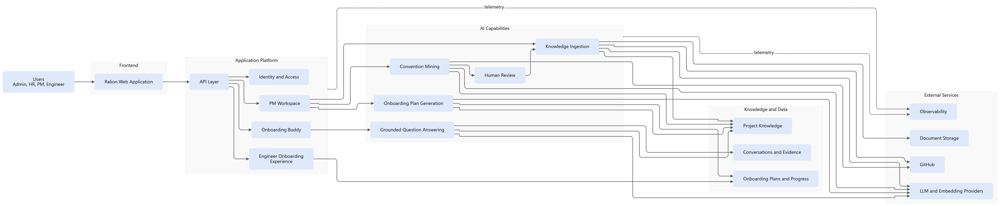
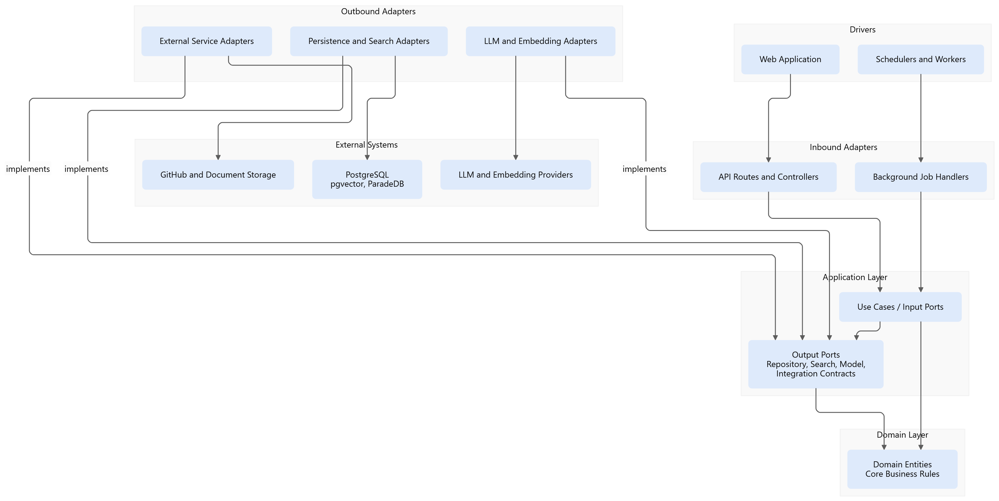

# Ralion

**Ralion là onboarding buddy cho đội ngũ kỹ thuật: tập trung tài liệu, quy ước và tiến độ onboarding vào một nơi để thành viên mới có thể tự tìm câu trả lời có nguồn kiểm chứng.**

Khi một kỹ sư mới vào dự án, kiến thức thường nằm rải rác trong tài liệu, repository, Pull Request và kinh nghiệm của người trong team. Ralion phục vụ Engineer, Product Manager (PM), HR và Admin bằng các workspace theo vai trò: PM quản lý dự án, tài liệu và kế hoạch onboarding; Engineer theo dõi checklist, báo blocker và hỏi về dự án; HR quản lý chính sách; Admin quản lý người dùng và membership.

Luồng chính của onboarding buddy là: đưa tài liệu dự án hoặc chính sách vào kho tri thức, giới hạn truy cập theo session và membership, rồi trả lời câu hỏi theo ngữ cảnh dự án/chính sách với citation. Bên cạnh tài liệu, Ralion có thể khai thác các quy ước lặp lại trong PR review thành rule candidate; PM của dự án phải duyệt trước khi quy ước đó được đưa vào kho tri thức để chat sử dụng.

## Vấn đề

Kiến thức cần để onboarding kỹ sư thường phân tán giữa tài liệu dự án, repository, PR review và người hướng dẫn. Khi không có một điểm tra cứu theo đúng project scope, thành viên mới khó xác định tài liệu nào còn hiệu lực, còn senior/PM phải lặp lại việc trả lời hoặc giải thích quy ước chưa được viết thành tài liệu.

Repository hiện không công bố số liệu sản xuất về thời gian hoặc chi phí onboarding; README vì vậy không đưa ra ước lượng định lượng không có nguồn.

## Giải pháp

- **Chat có nguồn kiểm chứng:** trả lời câu hỏi `PROJECT` hoặc `POLICY` trong phạm vi đã được kiểm tra, kèm trích dẫn khi bằng chứng được xác minh; nếu không đủ bằng chứng, hệ thống trả lời an toàn và nêu rõ lý do.
- **Luồng xử lý tri thức:** tiếp nhận tài liệu chính sách, tệp tải lên và tài liệu đồng bộ từ GitHub; nội dung được quét bí mật, phân loại, chia đoạn và tạo embedding trước khi truy hồi.
- **Không gian onboarding:** quản lý mẫu, kế hoạch, công việc, tiến độ và blocker cho Engineer/PM.
- **Duyệt quy ước:** tạo quy ước đề xuất từ nhận xét PR, sau đó PM duyệt trước khi quy ước được lập chỉ mục cho chatbot.

## Người dùng mục tiêu

- **Primary:** Engineer mới tham gia dự án, cần theo dõi onboarding plan và tra cứu kiến thức dự án có nguồn.
- **Secondary:** PM quản lý project, tài liệu, membership, onboarding plan và rule review; HR quản lý knowledge base chính sách; Admin quản lý người dùng và project membership.

## Hình ảnh và demo

### Chat có bằng chứng và trích dẫn



Engineer có thể hỏi trong phạm vi dự án hoặc chính sách. Câu trả lời đã xác minh
hiển thị trích dẫn để người dùng mở nguồn đối chiếu.



### Onboarding và theo dõi vướng mắc





### Tài liệu và quy ước kỹ thuật







## Bản demo trực tuyến

**Live URL:** [https://www.ralion-team040.me/vi](https://www.ralion-team040.me/vi)

Các màn hình nghiệp vụ yêu cầu đăng nhập bằng tài khoản đã được cấp cho môi trường Live Demo.

## Công nghệ sử dụng

| Lớp hệ thống                | Công nghệ                                                                        | Trách nhiệm                                                                               |
| --------------------------- | -------------------------------------------------------------------------------- | ----------------------------------------------------------------------------------------- |
| Frontend                    | Next.js, React, TypeScript, Tailwind CSS, TanStack Query, next-intl              | Giao diện theo role, i18n và gọi API cùng origin qua rewrite `/api/*`.                    |
| Backend                     | Python, FastAPI, Pydantic, SQLAlchemy async, Alembic                             | API `/api/v1`, validation, nghiệp vụ onboarding, chat, quản lý người dùng/dự án/tài liệu. |
| Agent / LLM                 | LangChain `ChatOpenAI`, OpenAI-compatible adapter, OpenAI hoặc OpenRouter        | Diễn giải turn, kiểm tra scope/evidence, sinh và kiểm chứng câu trả lời.                  |
| Retrieval / Search          | BAAI BGE-M3, Modal, pgvector, ParadeDB `pg_search`, BM25, Reciprocal Rank Fusion | Embedding, dense retrieval, lexical retrieval và hợp nhất kết quả trong cùng scope.       |
| Database                    | PostgreSQL 16 qua ParadeDB                                                       | Dữ liệu nghiệp vụ, tài liệu, version/chunk/vector, hội thoại, citation và telemetry.      |
| Object storage              | Cloudinary                                                                       | Lưu tệp tài liệu và attachment.                                                           |
| Authentication              | HttpOnly session cookie, session secret, project membership/role                 | Xác thực phiên và giới hạn scope theo người dùng, dự án và vai trò.                       |
| Observability               | Trace ID, structured logging, Langfuse (optional)                                | Theo dõi request/chat và metadata về thời gian, token, lỗi, chi phí.                      |
| Deployment / Infrastructure | Docker Compose, GitHub Actions, GHCR, Google Cloud VPS, Caddy, Vercel            | Build, kiểm thử, publish image, deploy Backend và Frontend.                               |

## Kiến trúc hệ thống

Hai sơ đồ dưới đây dùng Mermaid source để có thể render lại khi kiến trúc thay đổi.

### Kiến trúc hệ thống và thành phần

Sơ đồ này mô tả request đi từ giao diện tới FastAPI và các nhánh chính: nghiệp vụ onboarding, chat/RAG, ingestion tài liệu và rule mining. Chat chỉ truy hồi trong scope đã được kiểm tra; dense và BM25 dùng cùng điều kiện lọc trước khi RRF xếp hạng kết quả.



- Mã nguồn Mermaid: [ralion-system-architecture.mmd](docs/architecture/ralion-system-architecture.mmd)

### Sơ đồ phụ thuộc

Sơ đồ này tập trung vào chiều phụ thuộc tĩnh trong code, không phải luồng runtime. Hiện repository kết hợp router/service/module và SQLAlchemy model; các contract rõ nhất quanh retrieval/embedding là `QueryEmbeddingPort` và `Embedder`. `ConversationRepository` là repository concrete được chat module dùng trực tiếp.



- Mã nguồn Mermaid: [ralion-dependency-diagram.mmd](docs/architecture/ralion-dependency-diagram.mmd)

## Cấu trúc dự án

```text
.
├── frontend/                         # Next.js application
│   ├── src/app/                      # Routes theo locale và role
│   ├── src/features/                 # Chat, onboarding, documents, PM, admin...
│   ├── src/lib/api.ts                # API client và endpoint constants
│   └── next.config.ts                # Rewrite /api/* tới FastAPI
├── src/
│   ├── api/                          # FastAPI routers và dependencies
│   ├── ai/                           # Provider, orchestration, retrieval engine
│   ├── modules/
│   │   ├── chat/                     # Chat use case và conversation persistence
│   │   └── knowledge/                # Ingestion, GitHub sync, rule mining
│   ├── infrastructure/               # AI adapter, observability, scheduling, reliability
│   ├── model/                        # SQLAlchemy entities và database session
│   ├── services/                     # Nghiệp vụ cho API/workspace
│   └── main.py                       # ASGI entry point
├── modal_bge_m3/                     # Modal API phục vụ embedding BGE-M3
├── alembic/                          # Database migrations
├── config/                           # Knowledge source và retrieval/chunking config
├── deploy/                           # Docker Compose VPS, Caddy, systemd units
├── infra/gcp/                        # Terraform cho staging VPS
├── docs/                             # Tài liệu kỹ thuật và architecture Mermaid
├── scripts/                          # Seed, ingest, operational scripts
├── tests/                            # Backend test suite
├── docker-compose.yml                # Local PostgreSQL/ParadeDB + Backend
├── Dockerfile                        # Backend production image
├── requirements.txt                  # Python dependencies
└── .env.example                      # Backend environment variables mẫu
```

## Cài đặt nhanh

### Sao chép mã nguồn

```powershell
git clone https://github.com/ducTin25/Ralion.git
cd Ralion
```

### Điều kiện

- Python 3.11
- Node.js 24 và npm
- Docker Desktop / Docker Compose

### 1. Chuẩn bị Backend và cơ sở dữ liệu

```powershell
Copy-Item .env.example .env
python -m venv .venv
.\.venv\Scripts\Activate.ps1
python -m pip install -r requirements.txt

docker compose up -d db
python -m alembic upgrade head
python scripts/seed_dev_data.py

# PowerShell: nạp tài liệu tri thức mẫu nếu cần dữ liệu RAG sẵn có
Get-Content scripts\sql\seed_knowledge_documents.sql | docker exec -i p-040-db-1 psql -U app -d pgonboarding

uvicorn src.main:app --reload --port 8000
```

Database local được map qua cổng `5433`. `scripts/seed_dev_data.py` tạo user, project, membership, template, plan và blocker mẫu; script có thể chạy lại.

Tài khoản seed local dùng mật khẩu `ralionralion`; ví dụ `admin@onboarding.dev`, `hr@onboarding.dev`, `pm.phoneshop@onboarding.dev` và `engineer.phoneshop@onboarding.dev`.

### 2. Chạy Frontend

Mở terminal khác từ repository root:

```powershell
cd frontend
Copy-Item .env.example .env.local
npm.cmd install
npm.cmd run dev
```

Mở [http://localhost:3000/vi](http://localhost:3000/vi). Frontend mặc định rewrite `/api/*` tới `http://127.0.0.1:8000`; giữ API cùng origin giúp session cookie hoạt động đúng.

### Cấu hình môi trường chạy đáng chú ý

| Variable                                   | Khi cần                                 | Ghi chú                                                                                       |
| ------------------------------------------ | --------------------------------------- | --------------------------------------------------------------------------------------------- |
| `OPENAI_API_KEY` hoặc `OPENROUTER_API_KEY` | Gọi LLM                                 | Có thể chọn model qua `OPENROUTER_MODEL`; OpenRouter dùng `OPENROUTER_API_BASE`.              |
| `BGE_M3_ENDPOINT`, `BGE_M3_API_KEY`        | Embedding thật                          | Production cần embedding BGE-M3 1024 chiều; local có `USE_FAKE_EMBEDDER=true` trong file mẫu. |
| `SESSION_SECRET`                           | Production                              | Thay giá trị mẫu bằng secret riêng; secret này ký/xác thực session.                           |
| `CLOUDINARY_*`                             | Upload tài liệu/attachment              | Không cần để seed các URL mẫu đã có.                                                          |
| `GITHUB_CREDENTIAL_ENCRYPTION_KEY`         | Kết nối GitHub per-project ở production | Dùng để mã hoá token GitHub lưu at rest.                                                      |
| `LANGFUSE_*`                               | Observability mở rộng                   | Optional; thiếu key không chặn ứng dụng.                                                      |
| `API_UPSTREAM_URL`                         | Frontend                                | Địa chỉ Backend mà Next.js dùng cho rewrite; mặc định là localhost.                           |

### Các API chính

| Phương thức | Đường dẫn                                      | Mô tả                                                  |
| ----------- | ---------------------------------------------- | ------------------------------------------------------ |
| `GET`       | `/health`                                      | Health check của FastAPI.                              |
| `GET`       | `/ready`                                       | Kiểm tra khả dụng của database cho deployment.         |
| `POST`      | `/api/v1/auth/login`                           | Đăng nhập và cấp session cookie.                       |
| `GET`       | `/api/v1/auth/me`                              | Lấy identity, role và membership của session hiện tại. |
| `POST`      | `/api/v1/chat`                                 | Gửi câu hỏi chat trong domain `PROJECT` hoặc `POLICY`. |
| `GET`       | `/api/v1/chat/conversations/{conversation_id}` | Khôi phục transcript hội thoại đã lưu trong database.  |

## Kiểm tra chất lượng

```powershell
# Backend
ruff check src tests
pytest tests -v

# Frontend
cd frontend
npm.cmd run lint
npm.cmd run test
npm.cmd run build
```

GitHub Actions chạy quality gate Backend/Frontend, browser E2E, sau đó publish Backend image lên GHCR và deploy theo workflow trên nhánh `main`.

## Tài liệu liên quan

- [README của Frontend](frontend/README.md) — route, cách tổ chức chức năng và biến môi trường của Frontend.
- [Tài liệu triển khai](docs/deployment.md) — CI/CD và VPS staging.
- [Quy trình triển khai VPS](docs/deployment-vps-runbook.md) — cấp phát, triển khai, rollback và vận hành.
- [Pitch Deck](docs/pitch_deck.pdf) — bản trình bày Demo Day 23 slide.
- [Nhật ký phát triển](JOURNAL.md) và [Nhật ký công việc](WORKLOG.md) — quyết định kỹ thuật và lịch sử thực hiện.

## Danh sách sản phẩm bàn giao

- [x] Mã nguồn (GitHub)
- [x] README.md
- [x] Sơ đồ kiến trúc (`docs/architecture/ralion-dependency-diagram.mmd`, `docs/architecture/ralion-system-architecture.mmd`)
- [x] Nhật ký AI (thu thập tự động)
- [x] URL trực tuyến và triển khai
- [x] Video demo
- [x] Slide thuyết trình (`docs/pitch_deck.pdf`)
- [x] Nhật ký phát triển (`JOURNAL.md`, `docs/journal.md`)
- [x] Nhật ký công việc (`WORKLOG.md`, `docs/worklog.md`)
- [x] Bằng chứng đánh giá (`eval/results/`)

## Thành viên

| Thành viên         | Vai trò   | Mã học viên |
| ------------------ | --------- | ----------- |
| Vương Đức Thoại    | Fullstack | 2A202601770 |
| Trần Anh Thư       | Fullstack | 2A202601611 |
| Nguyễn Đức Tín     | Fullstack | 2A202601185 |
| Trần Hoàng Mai Anh | Fullstack | 2A202601324 |

## Giấy phép

MIT
