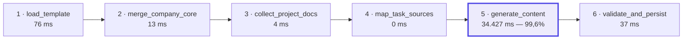
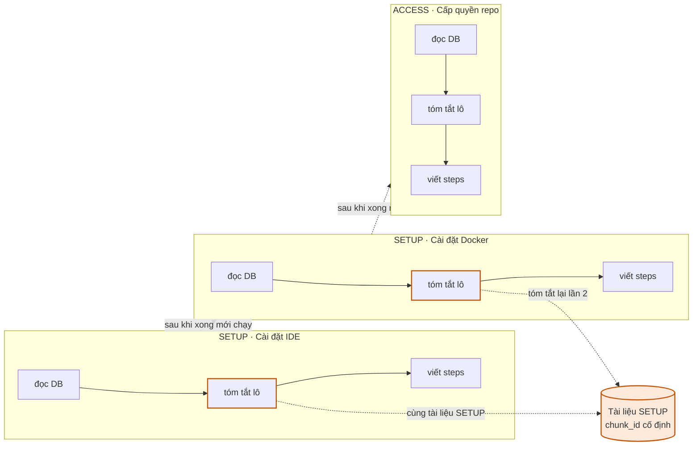
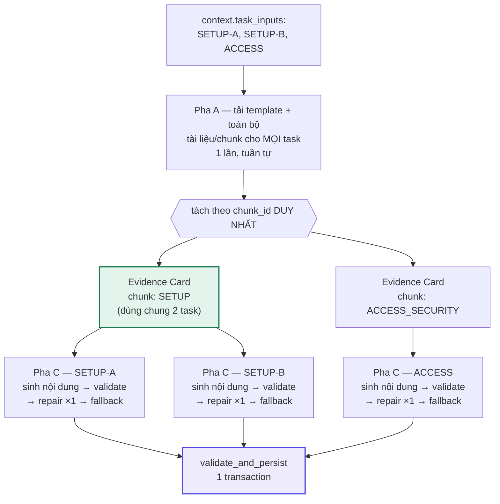

# Plan: Tối ưu tốc độ + chi phí LLM sinh Onboarding Plan, tăng cường verify khớp tài liệu (v3)

> Trạng thái: **CHỜ DUYỆT** — chưa code, chỉ viết plan. Bản v3 — chốt theo review vòng 2, có kèm sơ đồ
> kiến trúc/data flow (Mermaid, render trực tiếp trên GitHub/VS Code). Xem mục 0 để biết đổi gì so
> với v2. Bản HTML minh hoạ tương tác (cùng nội dung sơ đồ, dễ đọc hơn khi xem trên trình duyệt):
> `https://claude.ai/code/artifact/1fff0ae2-9ffa-4d23-a087-b70314fbcf16`.

## 0. Đổi gì so với bản v2 (chốt theo review vòng 2)

Bản v1 bị review vòng 1 chỉ ra 5 lỗi (đã sửa ở v2). Bản v2 được đánh giá "85% ổn", review vòng 2 chỉ
ra 7 điểm cần chốt thêm — đã tự verify lại 2 điểm còn nghi vấn bằng code thật trước khi chốt:

| # | Review vòng 2 chỉ ra | Verify bằng code thật | Sửa ở đâu trong bản v3 |
|---|---|---|---|
| 1 | Repair-once không nên để "PM chọn" | User tự chốt kiến trúc cuối review — đã quyết, không còn mở | Mục 3.3 |
| 2 | Nên chia 3 pha rõ ràng (load 1 lần → Evidence Card theo chunk duy nhất → sinh task song song), sạch hơn "2 pha + in-flight cache" | Đối chiếu `GenerationContext`/`TaskPlanInput` (`steps.py:76-96`) — cấu trúc data đã sẵn sàng cho thiết kế này, không cần đổi `map_task_sources` | Mục 3.1-3.3 viết lại hoàn toàn |
| 3 | Schema Evidence Card cần chốt cụ thể (JSON), verify `exact_quote` trước khi dùng | Đối chiếu `prompts.py` (đọc toàn bộ) — hiện chưa có field nào tương đương, phải thêm mới | Mục 3.2 |
| 4 | Cache key cần `chunk_id + content_hash + prompt_version + model`, không chỉ `chunk_id` | Đọc `versioning.py:139-183` — **`chunk_id` đã bất biến theo thiết kế** (version mới luôn tạo chunk mới, không sửa tại chỗ), cột `content_hash` đã có sẵn trên `DocumentChunk` (dòng 177). → Không phải bug như claim vòng 1, nhưng vẫn cần `prompt_version`/`model` cho cache xuyên-plan (lý do khác: đổi prompt/model phải invalidate dù nội dung chunk không đổi) | Mục 3.4 |
| 5 | Giới hạn Evidence Card: summary 80-150 từ, quote 160-240 ký tự | Chốt số cụ thể, có thể tune sau khi đo | Mục 3.2 |
| 6 | Header theo policy category chưa phải tab UI — chỉ là heading Markdown | Đọc `_build_sources_section` (`content_llm.py:384-421`) — phần nguồn ĐÃ có header theo nhóm; `_build_citation_index_block` (dòng 424-437) — phần nuôi "Các bước thực hiện" thì chưa | Mục 3.2, khoanh phạm vi rõ |
| 7 | Langfuse có thể không tính được cost cho DeepSeek qua custom `base_url`, dashboard hiện cost = 0 | Grep `tracing.py` — **không có bảng giá custom nào đăng ký** cho `deepseek-chat` | Mục 5 (benchmark) |

## 1. Context / Vấn đề

Bước sinh Candidate/Onboarding Plan bằng AI đang chậm — PM tự cảm nhận "lâu quá" khi bấm "Tạo lại
bằng AI" ở màn `owner-plan-generating`. Yêu cầu: tối ưu **chi phí** gọi LLM, tối ưu **tốc độ**, đánh
giá xem nội dung Plan AI sinh ra **có thực sự khớp tài liệu nguồn** không, và tổ chức lại nội dung
"Tìm hiểu công ty" theo header từng nhóm chính sách cho gọn.

Scope: chỉ bước `generate_content` (bước 5/6 của pipeline sinh plan) — 5 bước còn lại là business
logic thuần không gọi LLM.

## 2. Hiện trạng (đọc trực tiếp code, verify 2 vòng)

### 2a. Bottleneck — số liệu thật + sơ đồ pipeline tổng thể

Theo `docs/PM/Phase-4/report-phase4.md` (dòng 86, 346-352), sinh 1 plan 7 task trên project GADGETHUB:



Tổng **34.572 mili-giây (≈ 34,6 giây)**, bước `generate_content` chiếm **34.427 mili-giây (≈ 34,4
giây, 99,6%)**, 5 bước còn lại cộng lại **130ms**. (Viết rõ "mili-giây"/"giây" thay vì `34.427ms` để
tránh đọc nhầm dấu `.` thành phân cách thập phân — lỗi đã có ở bản v1.)

### 2b. Nguyên nhân — vòng lặp tuần tự qua từng task

`generate_ai_content()` (`content_llm.py:468-534`) lặp `for task_input in context.task_inputs:`
**tuần tự**. Mỗi task: đọc DB (`_collect_outlines`, dòng 490, dùng chung 1 `AsyncSession db`) → tóm
tắt lô (đã parallel *trong* 1 task qua `asyncio.gather` + `Semaphore(4)`, dòng 480, 504-509) →
`_generate_steps_section` (dòng 513, **không giới hạn semaphore** — an toàn hiện tại chỉ vì loop
tuần tự). **Không có song song giữa các task với nhau.**

### 2c. Trùng lặp tính toán — phạm vi thật, kèm sơ đồ minh hoạ

**Root cause đúng, đọc từ `map_task_sources` (`steps.py:233-248`)**:

```python
task_inputs: list[TaskPlanInput] = []
for task in context.template_tasks:                              # 1 lần / TemplateTask
    allowed: list[DocumentRef] = []
    ...                                                            # tra TASK_CATEGORY_DOCUMENT_MAP
    task_inputs.append(TaskPlanInput(template_task=task, allowed_documents=allowed))
context.task_inputs = task_inputs
```

Vòng lặp chạy **1 lần cho mỗi `TemplateTask`**, không group theo `category` — **bất kỳ category nào
có >1 task trong template đều bị fetch + tóm tắt lại từ đầu**, độc lập với nhau. Ví dụ minh hoạ (2
task SETUP + 1 task ACCESS):



Riêng `TASK_CATEGORY_POLICY_MAP` (`steps.py:49-59`) còn thêm 1 lớp chồng lấn khác: `COMPANY: None`
(đọc hết mọi POLICY) và `ACCESS: (PolicyCategory.SECURITY_POLICY,)` — 2 category này cùng kéo về
chung bộ chunk SECURITY_POLICY.

→ Mức độ trùng lặp thực tế phụ thuộc cấu trúc template thật (bao nhiêu category có >1 task) — **phải
đo bằng dữ liệu thật lúc verify (mục 6), không đoán trước con số**.

### 2d. Cơ chế verify khớp tài liệu — giới hạn thật, và vì sao chưa đủ để làm exact-quote ngay

- `_citations_within_range()` (`content_llm.py:213-220`) chỉ kiểm tra số `[n]` có hợp lệ về cấu trúc.
- **Gap quan trọng**: `_generate_steps_section` xây prompt từ `_build_citation_index_block` (dòng
  424-437) — hàm này **cố tình không đưa nội dung chunk vào** (docstring dòng 427-428). Muốn LLM trả
  `exact_quote` thật, phải đổi dữ liệu đưa vào prompt trước — không thể chỉ đổi câu lệnh yêu cầu.
- So sánh: bên chat (`answer_generator.py:63-74`, `_verified_substring`) đã có sẵn cơ chế này vì có
  content để verify. Plan generation chưa có — phải xây thêm (mục 3.2).
- Bộ eval Day-14 (golden dataset, RAGAS, LLM-as-Judge) **chưa làm** (`report-phase4.md:476-478`).

### 2e. Ràng buộc lịch sử — không được vi phạm

**Không quay lại BM25/top-K cắt bớt tài liệu** — đã thử, gây regression thật (rớt 14/18 tài liệu
policy, `tools.py:98`, `report-citation-coverage.md:334`). Mọi tối ưu phải giữ nguyên độ phủ tài liệu
đầy đủ theo từng task.

## 3. Thiết kế đề xuất — kiến trúc 3 pha

**Phạm vi thay đổi**: `content_llm.py` (viết lại `generate_ai_content`), `prompts.py` (prompt tóm tắt
+ prompt viết steps), 1 module verify dùng chung mới (`src/ai/text_verification.py`, tách từ
`answer_generator.py`), `job_store.py` (nếu làm mục 3.6), config settings mới, và
`PM-test/test_plan_generation.py`.

Kiến trúc tổng thể (thay cho "2 pha + in-flight cache" của bản v2 — sạch hơn, loại bỏ hẳn nguy cơ
cache stampede bằng thiết kế thay vì bằng cơ chế khoá runtime):



So với sơ đồ ở mục 2c: Pha B tách theo **2 chunk duy nhất** (không phải 3 lần gọi riêng theo task) —
sửa vấn đề trùng lặp; Pha C chạy cả 3 task **song song có giới hạn** thay vì nối đuôi — sửa vấn đề
tuần tự.

### 3.1 Pha A — tải dữ liệu 1 lần (tuần tự, chỉ đọc DB)

Duyệt `context.task_inputs` (đã được `map_task_sources` build sẵn đầy đủ trước khi `generate_content`
chạy — không cần đổi bước đó) **1 lần**, gọi `_collect_outlines` cho từng task như hiện tại, nhưng
memoize theo `version_id` (`fetch_all_document_chunks` chỉ gọi 1 lần cho mỗi `version_id` dù nhiều
task cùng tham chiếu — rủi ro = 0 vì version bất biến, xem mục 3.4). Kết quả: có đủ toàn bộ outline
của mọi task, và từ đó tính được **tập `chunk_id` DUY NHẤT** cần tóm tắt trên toàn bộ lần sinh plan
này (dedup trước khi gọi LLM, không phải chống trùng lúc chạy như in-flight-map của bản v2).

An toàn `AsyncSession`: không đổi gì về mặt an toàn — vẫn tuần tự, vẫn đọc DB như hiện tại, chỉ khác
là làm cho TOÀN BỘ task trước khi bước sang Pha B (thay vì xen kẽ đọc-DB/gọi-LLM như code hiện tại).
5 bước non-LLM của cả pipeline vốn đã rẻ (130ms theo `report-phase4.md`), Pha A không phải bottleneck.

### 3.2 Pha B — Evidence Card cho từng chunk duy nhất (song song, giải quyết gap grounding + header)

**Schema Evidence Card — chốt cụ thể**:
```json
{"chunk_id": 123, "summary": "...", "exact_quote": "..."}
```
- `summary`: khoảng **80-150 từ** (default ban đầu, tune sau khi đo).
- `exact_quote`: khoảng **160-240 ký tự**, lấy trực tiếp từ `chunk.content` — LLM được yêu cầu trích
  nguyên văn, không diễn giải.
- **Backend bắt buộc verify** `exact_quote` là substring thật của `DocumentChunk.content` đầy đủ
  (dùng module dùng chung tách từ `answer_generator._verified_substring`) trước khi cho phép dùng làm
  citation. Verify fail → Evidence Card đó vẫn giữ `summary` (theo đúng pattern
  `UNSUMMARIZED_CHUNK_NOTE` sẵn có — không coi là lỗi cả plan) nhưng không có quote khả dụng để trích
  dẫn chính xác cho chunk đó.

**Chạy song song có giới hạn**: 1 lời gọi LLM cho mỗi Evidence Card (mỗi lô ≤10 chunk như cơ chế batch
hiện tại, `MAX_CHUNKS_PER_BATCH=10`), `asyncio.gather` bọc `Semaphore(4)` — reuse hằng số
`MAX_CONCURRENT_LLM_CALLS` đã tune sẵn (`content_llm.py:57-59`).

**Bắt buộc bỏ `task_title`/`task_objective` khỏi prompt tóm tắt** (`prompts.build_batch_summary_prompt`,
hiện nhận 2 tham số này ở dòng 82-88) — khác bản v1 (để "PM chọn"), giờ là **bắt buộc**: Evidence Card
giờ dùng chung cho nhiều task nên nội dung phải độc lập ngữ cảnh gọi, không được "nhuốm văn phong"
của task gọi trước.

**Header theo policy category — khoanh đúng phạm vi (điểm 6 review vòng 2)**: `_build_sources_section`
(`content_llm.py:384-421`) — phần "Tài liệu nguồn cần đọc" — **đã render header `### <tên nhóm>` theo
category rồi** (dùng `POLICY_CATEGORY_LABELS`, dòng 63-70), không cần sửa. Chỗ thiếu là
`_build_citation_index_block` (nuôi prompt viết "Các bước thực hiện") — đưa danh sách phẳng, không
nhóm. Sửa: khi build Evidence Card list cho 1 task, nhóm theo `policy_category` (dùng lại
`POLICY_CATEGORY_LABELS`), yêu cầu prompt (`prompts.py`) chỉ dẫn LLM viết sub-heading `### <tên nhóm>`
khớp khi outline có >1 nhóm chính sách (chỉ COMPANY gặp trường hợp này, category duy nhất đọc `None`).
**Chỉ dừng ở heading Markdown trong nội dung — KHÔNG tạo tab/nút bấm trên UI PM/Member Portal.** Việc
đó là 1 task FE riêng (đổi component hiển thị task để render heading thành tab), không gộp vào plan
backend này.

### 3.3 Pha C — sinh nội dung từng task (song song, repair-once đã chốt)

Mỗi task (chạy song song, `Semaphore(4)` dùng chung với Pha B — 1 semaphore duy nhất cho toàn bộ
Pha B+C, không phải 2 semaphore riêng): tự tra Evidence Card theo `chunk_id` trong outline của mình,
tự tính lại `citation_order` **cục bộ theo task đó** (y hệt cách `_build_sources_section` đang đếm
`order`, dòng 404 — không lấy số từ Pha B) rồi ráp prompt viết "Các bước thực hiện".

**Repair-once — ĐÃ CHỐT** (user tự quyết định kiến trúc, không còn để ngỏ như v2): validate → sai
schema/citation → gửi lại đúng lỗi cụ thể qua 1 prompt ngắn (repair) → validate lại → vẫn sai →
fallback baseline. **Log đầy đủ mỗi lần repair được dùng** (task nào, lỗi gì, có cứu được không) —
giữ tín hiệu eval thay vì che giấu, đúng tinh thần docstring gốc (`content_llm.py:542-543`: "Không
'sửa hộ' output của LLM vì sẽ che mất lỗi thật khi đo eval") nhưng không còn "fail là fallback ngay".

Giữ nguyên cơ chế "lỗi 1 task không hỏng cả plan" (dòng 473-474) — chỉ dời vị trí code.

Sau Pha C: `validate_and_persist` (bước 6 pipeline có sẵn) lưu transaction — không đổi.

### 3.4 Cache xuyên nhiều lần sinh plan (Phase 2 — chỉ phác thảo, KHÔNG làm đợt này)

**Trong 1 lần sinh (Pha A/B)**: `chunk_id` đơn thuần đã đủ an toàn — verify qua `versioning.py:139-183`:
mỗi `DocumentVersion` mới tạo hẳn `DocumentChunk` mới, chunk cũ không bao giờ bị sửa nội dung tại chỗ.

**Cho cache xuyên-plan tương lai** (không làm đợt này): key phải là `chunk_id + prompt_version +
model` — không phải vì `chunk_id` không an toàn (đã verify an toàn), mà vì đổi prompt tóm tắt hoặc
đổi model sau này phải invalidate cache cũ dù nội dung chunk không đổi. Cột `content_hash` đã có sẵn
trên `DocumentChunk` (`versioning.py:177`) nên có thể thêm miễn phí làm lớp phòng thủ kép.

**Lý do thật để làm cache xuyên-plan** (đã sửa từ v1 — "kỹ sư thứ 2" SAI vì họ dùng
`load_reference_content`, `content_llm.py:142-210`, clone không gọi LLM):
1. PM bấm **Regenerate trên reference plan** — đường DUY NHẤT còn gọi lại AI sau khi đã có 1 lần sinh.
2. Project khác dùng chung Company Core.
3. Cùng `DocumentVersion` được dùng lại nói chung.

Cần bảng mới (`document_batch_summary_cache`, key như trên), invalidate tự nhiên nhờ INV2 khi rotate
version. **Đề xuất: ticket riêng, làm sau khi đo được hiệu quả của Pha A-C trong thực tế.**

### 3.5 Progress reporting (tùy chọn, không bắt buộc)

Thêm `job_store.update_step_detail()` để cập nhật "x/N task đã xử lý" theo thời gian thực trong Pha C
(đổi `asyncio.gather` → `asyncio.as_completed`). FE (`PlanGeneratingView.tsx:106`) đã render `detail`
vô điều kiện — không cần đổi FE. Không ảnh hưởng tốc độ thật, chỉ UX.

### 3.6 An toàn concurrency/chi phí

Giữ `MAX_CONCURRENT_LLM_CALLS=4` (khoảng 3-4 theo đề xuất review, 4 là giá trị đã tune sẵn trong code
— giữ nguyên ở đợt đầu). 1 semaphore duy nhất chia sẻ giữa Pha B và Pha C — không tách riêng. Không
tăng giá trị 4 (lý do đã tune, `content_llm.py:57-58`) cho tới khi đo được rate-limit headroom thật.

## 4. Impact dự kiến (định tính — không bịa số chưa đo được)

- **Pha A/C song song**: chỉ giảm **latency**. Ước lượng định hướng `⌈N/4⌉ × thời gian 1 task` —
  **KHÔNG phải cam kết SLA**, số thật phụ thuộc phân bố thời gian từng task, cần đo (mục 5).
- **Pha B dedup**: giảm cả **chi phí thật** — phạm vi phụ thuộc cấu trúc template thật (bao nhiêu
  category có >1 task), phải đo, không đoán trước %.
- **Evidence Card + faithfulness (3.2/3.3)**: cải thiện **chất lượng**, có thể tăng nhẹ chi phí (1
  lần gọi thêm khi repair) — trình bày tách bạch, không gộp vào "lợi ích tốc độ/chi phí".
- **Header theo category**: cải thiện UX đọc, không ảnh hưởng tốc độ/chi phí đáng kể.

## 5. Kế hoạch verify (khi bắt đầu code — không phải việc của lượt viết plan này)

**Benchmark Langfuse — đo cụ thể**:
- Tổng trace `generate_candidate_plan`, số request LLM thực tế (phải giảm rõ nhờ Pha B dedup).
- Token (input/output) + cost — **có fallback tính tay**: grep `tracing.py` xác nhận **không có bảng
  giá custom nào đăng ký cho `deepseek-chat`** — nếu Langfuse không tự nhận diện được giá qua custom
  `base_url`, cost hiện 0 dù trace/token đúng. Phải tính `input_tokens × giá_in + output_tokens ×
  giá_out` bằng 1 bảng giá config cứng cho DeepSeek làm phương án dự phòng, không tin tưởng tuyệt đối
  vào cost hiển thị trên dashboard.
- **p50/p95** latency của `generate_content` qua nhiều lần chạy (không chỉ 1 mẫu).
- **Tỉ lệ cache-hit** (Pha B) và **tỉ lệ fallback-về-baseline** (Pha C, trước/sau khi bật faithfulness
  check + repair-once).

**Đo trùng lặp thật**: chạy trên project có template thật nhiều category >1 task, xác nhận % giảm số
lời gọi LLM đúng như mục 4 dự đoán, không chỉ 1 điểm ví dụ.

**Nội dung không đổi nghĩa**: diff `PlanTask.instruction`/`PlanTaskSource`/`PlanTaskCitation` trước/
sau cho task dùng chung tài liệu; PM tự đọc đánh giá văn phong sau khi bỏ task-framing khỏi prompt
tóm tắt có còn tự nhiên không.

**Cách ly lỗi**: giả lập 1 task lỗi, xác nhận chỉ task đó fallback, job vẫn `DONE`.

**Header category**: "Các bước thực hiện" của task COMPANY thật (project có đủ 5 nhóm policy) có
đúng sub-heading khớp `POLICY_CATEGORY_LABELS`, không thiếu/thừa nhóm nào.

**Test tự động**: `PM-test/test_plan_generation.py` hiện tắt AI — thêm case bật AI (mock LLM) kiểm
tra: (a) song song không hỏng thứ tự citation; (b) Evidence Card trả đúng summary/quote, dùng chung
đúng cho 2 task khác `citation_order`; (c) 1 task lỗi giả lập không ảnh hưởng task khác; (d) header
category xuất hiện đúng khi outline có >1 nhóm; (e) log xuất hiện khi repair-once được dùng.

## 6. Ngoài phạm vi lần này

- Không sửa file code nào (`content_llm.py`, `pipeline.py`, `job_store.py`, `prompts.py`,
  `answer_generator.py`...) — chỉ viết plan + sơ đồ.
- Không làm cache xuyên-nhiều-plan (mục 3.4) — chỉ phác thảo hướng.
- Không làm golden dataset/eval report (`docs/PM/plan-pm.md` mục 4.1-4.8) — việc khác, lên lịch riêng.
- Không làm UI tab theo policy category (mục 3.2) — task FE riêng.

## File liên quan khi bắt đầu code

- `src/services/plan_generation/content_llm.py`
- `src/services/plan_generation/pipeline.py`
- `src/services/plan_generation/steps.py` (đọc, không đổi — tham chiếu `TASK_CATEGORY_*_MAP`,
  `GenerationContext`, `TaskPlanInput`)
- `src/services/plan_generation/prompts.py`
- `src/services/plan_generation/job_store.py` (nếu làm 3.5)
- `src/ai/orchestration/answer_generator.py` (nguồn để tách `verified_substring`)
- `src/ai/text_verification.py` (mới, module dùng chung)
- `src/config.py` (settings flag mới nếu cần, vd bảng giá DeepSeek cho mục 5)
- `PM-test/test_plan_generation.py`
