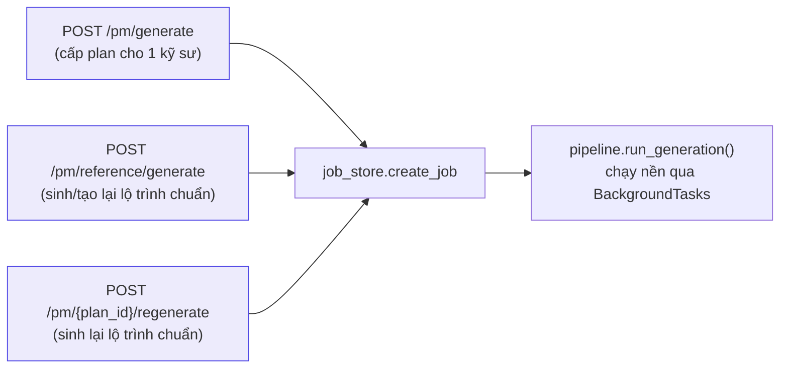
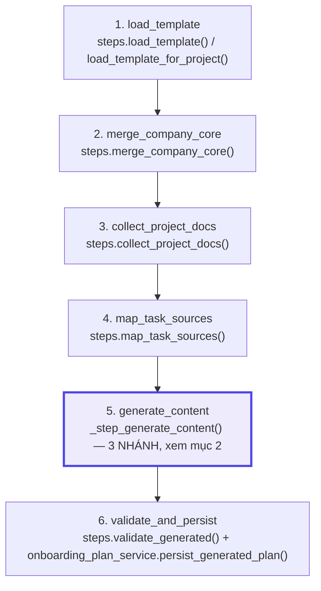
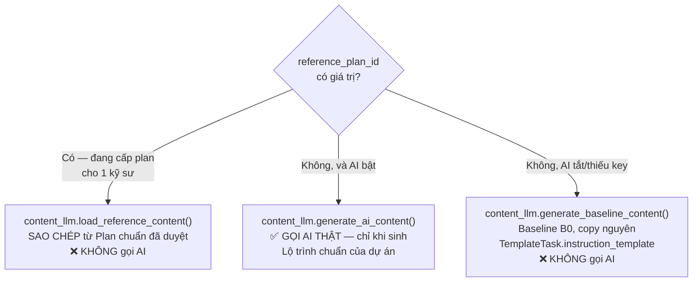
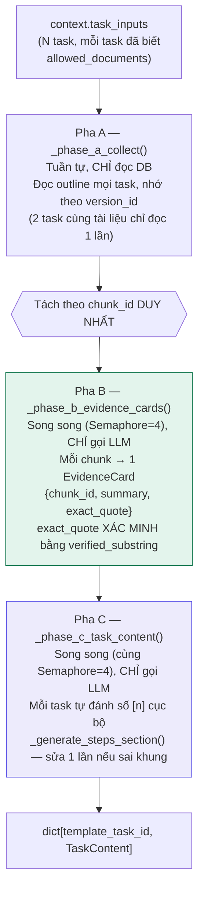
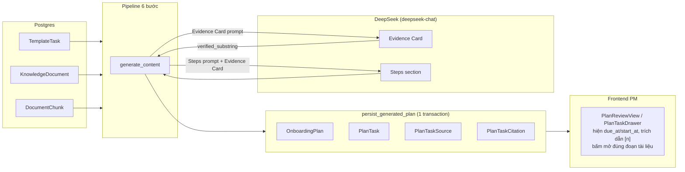

# Report: Toàn bộ quá trình sinh Onboarding Plan — hàm/lớp, kiến trúc, và tình trạng AI Engineering

> Tài liệu tổng hợp, KHÔNG code. Mục đích: PM đọc hiểu trọn vẹn 1 lượt "Sinh plan" chạy qua những
> hàm/lớp nào, dữ liệu đi đâu, và đối chiếu với 5 trụ cột AI Engineering (guardrail, eval, golden
> set, benchmark, tracing/cost) — cái nào đã có, cái nào chưa, chưa thì thiếu đúng chỗ nào.

## 1. Toàn cảnh — 3 con đường sinh nội dung, 1 pipeline 6 bước

Có **3 API khác nhau** đều chạy chung 1 pipeline (`pipeline.run_generation`), chỉ khác ở
`_step_generate_content` chọn nhánh nào:

`run_generation()` (`src/services/plan_generation/pipeline.py:88`) chạy tuần tự đúng 6 bước, mỗi
bước bọc `@observe_step` (Langfuse) + `job.start_step`/`finish_step` (để FE poll tiến độ) +
`log_step_event` (structured log JSON):

**Mục đích từng bước** (đọc `src/services/plan_generation/steps.py`):

| Bước | Hàm | Mục đích | Có gọi LLM? |
|---|---|---|---|
| 1 | `load_template` | Đọc `TemplateVersion` **đã duyệt** của dự án + toàn bộ `TemplateTask`/`TaskDependency` | Không |
| 2 | `merge_company_core` | Đọc mọi `KnowledgeDocument` domain POLICY đang ACTIVE (Company Core) | Không |
| 3 | `collect_project_docs` | Đọc `KnowledgeDocument` domain PROJECT của đúng dự án, lấy từ `membership` trong DB (không tin client) | Không |
| 4 | `map_task_sources` | Ghép mỗi `TemplateTask` với đúng bộ tài liệu được phép đọc, theo `TASK_CATEGORY_DOCUMENT_MAP`/`TASK_CATEGORY_POLICY_MAP` cố định bằng code | Không |
| 5 | `generate_content` | Điền nội dung hướng dẫn cho từng task | **Tuỳ nhánh** — xem mục 2 |
| 6 | `validate_and_persist` | Kiểm tra bất biến (đủ task bắt buộc, không có chu trình phụ thuộc) rồi ghi `OnboardingPlan`+`PlanTask`+`PlanTaskSource`+`PlanTaskCitation` trong 1 transaction, tính hạn từng task | Không |

## 2. Bước 5 — 3 nhánh, chỉ 1 nhánh THẬT SỰ gọi AI

`_step_generate_content` (`pipeline.py:52-68`) chọn nhánh theo thứ tự ưu tiên:

**Vì sao chỉ 1 nhánh gọi AI**: `SoT §12` — kỹ sư cùng dự án phải nhận nội dung giống nhau, sinh lại
bằng AI cho từng người vừa tốn tiền vừa cho nội dung lệch nhau. Nên: **AI chỉ chạy đúng 1 lần khi PM
sinh/tạo lại Lộ trình chuẩn**; mọi lần "cấp plan cho 1 kỹ sư" sau đó chỉ là COPY, không tốn 1 đồng
token nào.

## 3. Bên trong `generate_ai_content` — kiến trúc 3 pha (đã sửa gần đây)

**Hàm/lớp then chốt** (`src/services/plan_generation/content_llm.py`):

| Hàm/lớp | Việc gì |
|---|---|
| `EvidenceCard` (dataclass) | Đơn vị dữ liệu: 1 đoạn tài liệu → `{chunk_id, summary, exact_quote}` |
| `LlmUsage` (dataclass) | Đếm số lời gọi LLM + input/output token + `estimated_usd()` cho 1 lượt sinh — xem mục 5 |
| `_build_batch_cards()` | Gọi LLM tóm tắt 1 lô ≤10 đoạn, parse JSON, xác minh `quote` bằng `verified_substring` |
| `_generate_steps_section()` | Gọi LLM viết "Các bước thực hiện" từ Evidence Card của task đó; sai khung/trích dẫn thì **sửa lại 1 lần** (`build_repair_prompt`), vẫn sai thì trả `None` |
| `_build_sources_section()` | RÁP BẰNG CODE mục "Tài liệu nguồn cần đọc" — bao phủ tài liệu là bất biến của code, không phụ thuộc LLM có nhớ liệt kê đủ không |
| `text_verification.verified_substring()` | Xác minh 1 câu trích có THẬT trong tài liệu — khoan dung khoảng trắng/hoa-thường, không khoan dung diễn giải lại |

## 4. Data flow đầy đủ — từ DB tới UI

## 5. Đối chiếu 5 trụ cột AI Engineering — CÁI GÌ CÓ, CÁI GÌ CHƯA

### 5.1 Guardrail (chặn output sai TRƯỚC khi tới người dùng) — **CÓ, khá đầy đủ**

| Guardrail | Hàm | Chặn gì |
|---|---|---|
| Khung markdown bắt buộc | `_validate_instruction()` | Thiếu `## Mục tiêu` → từ chối |
| Trích dẫn trong phạm vi | `_citations_within_range()` | `[n]` ngoài số nguồn thật → từ chối |
| Quote đúng nguyên văn | `verified_substring()` | Câu trích không có thật trong chunk → loại RIÊNG câu đó, không loại cả card |
| Bao phủ tài liệu | `_build_sources_section()` | Ráp bằng code, LLM không thể làm mất tài liệu |
| Sửa 1 lần rồi mới bỏ | `build_repair_prompt()` + vòng lặp 2 lần trong `_generate_steps_section` | Không fallback ngay lần đầu sai, nhưng cũng không sửa vô hạn |
| Fallback an toàn | `except Exception` trong `_phase_c_task_content` | 1 task lỗi không hỏng cả plan, rơi về baseline |

→ Đây là guardrail **DETERMINISTIC** (luật cứng, if/else) — mạnh về "không bịa, không trích sai
nguồn", nhưng **KHÔNG đo được chất lượng NỘI DUNG** (câu văn có hay, có đủ ý, có đúng trọng tâm task
không) — đó là việc của Evaluation (mục 5.2).

### 5.2 Evaluation / Golden set / Benchmark — **CHƯA LÀM, đã lên kế hoạch từ lâu nhưng chưa thực thi**

`docs/PM/plan-pm.md` mục 4.1-4.8 (viết từ trước khi code Phase 4) đã thiết kế sẵn:
- Baseline B0 so sánh (copy nguyên `instruction_template`) — **đã có sẵn trong code**
  (`generate_baseline_content`), chỉ chưa dùng để SO SÁNH có hệ thống.
- Golden dataset 20 case, RAGAS-style (Faithfulness/Context Recall/Context Precision), LLM-as-Judge
  reference-based, failure analysis 5-Whys — **0 dòng code, 0 file dữ liệu**. Đã tìm khắp
  `docs/PM/Phase-4/` — không có `eval-golden-dataset.jsonl` hay `eval-report.md` nào.

**Hệ quả cụ thể**: không có con số nào trả lời được câu "AI sinh nội dung có THỰC SỰ tốt hơn PM tự
copy template không" — chỉ có cảm nhận định tính qua vài lần PM đọc thử (`report-phase4.md`,
`report-fix-onboarding-plan-quality.md`). Muốn có số thật phải làm đúng mục 4.1-4.8 nói trên.

### 5.3 Tracing / Logging — **CÓ, khá đầy đủ**

- **Langfuse** (`src/observability/tracing.py`): `@observe_step` bọc cả 6 bước pipeline +
  1 span gốc `generate_candidate_plan` bọc toàn bộ — xem được cây trace đầy đủ, biết bước nào chậm.
  Cấu hình qua 3 biến `langfuse_public_key`/`langfuse_secret_key`/`langfuse_host` — thiếu key thì
  tự no-op, không chặn dev/CI.
- **Structured logging**: `log_step_event()` ghi JSON mỗi bước (`event`, `correlation_id`,
  `duration_ms`, ...) — không log nguyên văn nội dung tài liệu/task (tránh lộ dữ liệu nhạy cảm).
- **`LlmUsage`** (mới thêm gần đây, `content_llm.py`): đếm số lời gọi LLM + input/output token +
  `estimated_usd()`, log 1 dòng cuối mỗi lượt sinh: *"N lời gọi LLM, N chunk duy nhất, N Evidence
  Card (N có trích dẫn đã xác minh), N input + N output token, ~X USD"*.

### 5.4 Cost / chi phí hiện trên dashboard mỗi dự án — **CHƯA CÓ**

Đã kiểm tra trực tiếp `pm_dashboard_service.py` và mọi router — **không có API/field nào trả về
cost hay token**. `LlmUsage` (mục 5.3) hiện chỉ nằm trong **1 dòng log**, không được:
- Lưu xuống DB (không có bảng nào giữ lịch sử cost theo dự án/lần sinh).
- Trả về qua API nào (kể cả `PlanGenerationJobResponseDTO` — job chỉ có `duration_ms`, không có cost).
- Hiện trên `owner-overview` (PM Dashboard) hay bất kỳ màn hình nào.

→ Muốn PM nhìn thấy "dự án này tốn bao nhiêu tiền AI từ đầu tới giờ" trên dashboard, cần làm thêm
(việc mới, chưa có trong scope nào đã duyệt):
1. Bảng mới (vd `plan_generation_cost_log`: `project_id`, `plan_id`, `input_tokens`,
   `output_tokens`, `estimated_usd`, `created_at`) — ghi 1 dòng mỗi lần `generate_ai_content` chạy
   xong (đã có sẵn số liệu trong `LlmUsage`, chỉ cần ghi xuống DB thay vì chỉ log).
2. 1 field tổng hợp trong `pm_dashboard_service`/`PmDashboardSummaryResponseDTO` — SUM cost theo
   `project_id`.
3. 1 KPI tile mới trên `DashboardView.tsx` (owner-overview) — cạnh 5 KPI hiện có.

## 6. Tóm tắt — bảng điểm nhanh

| Trụ cột | Trạng thái | Ghi chú |
|---|---|---|
| Guardrail (chặn output sai) | ✅ Có | Deterministic, mạnh về grounding/citation, không đo chất lượng văn phong |
| Golden dataset | ❌ Chưa | 0 file, đã thiết kế schema từ lâu (`plan-pm.md` §4.3) |
| Evaluation metrics (RAGAS-style) | ❌ Chưa | Đã thiết kế công thức (`plan-pm.md` §4.4), chưa code |
| LLM-as-Judge | ❌ Chưa | Đã thiết kế rubric (`plan-pm.md` §4.5), chưa code |
| Benchmark AI vs Baseline B0 | ❌ Chưa | Baseline B0 đã có code sẵn, chỉ chưa dùng để so sánh |
| Tracing (Langfuse) | ✅ Có | Đủ 6 bước + span gốc |
| Structured logging | ✅ Có | JSON, không lộ dữ liệu nhạy cảm |
| Đếm token/cost | 🟡 Nửa vời | Tính đúng, nhưng chỉ nằm trong 1 dòng log, chưa lưu DB |
| Dashboard hiện cost theo dự án | ❌ Chưa | Cần bảng DB mới + sửa dashboard service + FE — việc mới |

## 7. Việc tiếp theo — đề xuất, cần PM chọn ưu tiên

1. **Golden dataset + eval (mục 5.2)** — việc lớn nhất còn thiếu, quyết định được "AI có đáng dùng
   không" bằng số chứ không phải cảm tính. Theo đúng `plan-pm.md` §4.1-4.8 đã thiết kế sẵn.
2. **Lưu cost xuống DB + hiện lên dashboard (mục 5.4)** — việc nhỏ, tận dụng `LlmUsage` đã có sẵn số
   liệu đúng, chỉ cần thêm 1 bảng + 1 field tổng hợp + 1 KPI tile.
3. Cả 2 việc trên **độc lập với nhau**, làm việc nào trước cũng được.

Đây chỉ là báo cáo hiện trạng — chưa phải plan chi tiết để code. Bạn xem xong chọn việc nào muốn làm
trước thì mình lập plan chi tiết riêng cho việc đó.
