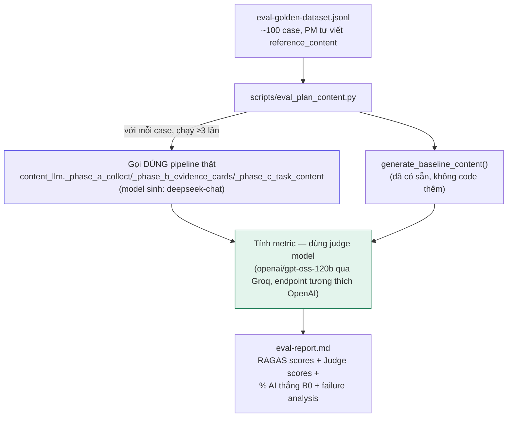

# Plan: Evaluation cho bước sinh nội dung Onboarding Plan bằng AI

> Trạng thái: **ĐÃ CHẠY XONG ĐỦ 30/30 CASE THẬT.** Kết quả số liệu →
> `docs/PM/Phase-4/eval-report.md`. Hướng dẫn hàm/cách chạy lại → `docs/PM/report-evaluation.md`.
>
> **Judge model CUỐI CÙNG là OpenAI `gpt-4o-mini`, KHÔNG PHẢI Groq** như quyết định ở mục 1 dưới đây
> — mục 1 vẫn giữ nguyên làm nhật ký quyết định lúc đó (Groq lúc lên plan test rate-limit ổn), nhưng
> khi chạy thật hàng loạt Groq free tier bị 429 chập chờn không sửa được dù đã thử nhiều cách. Xem
> hành trình đổi model đầy đủ (3 vòng) ở `docs/PM/report-evaluation.md` mục 7.
>
> Đây là bản mở rộng, đối chiếu lại với code thật,
> của thiết kế gốc `docs/PM/plan-pm.md` §4.1-4.8 (viết trước khi code Phase 4, chưa từng thực thi —
> xác nhận lại trong `docs/PM/Phase-4/report-onboarding-plan-pipeline-overview.md` mục 5.2). 2 việc
> nhỏ khác (bug logging/LangSmith, Cost Dashboard) đã lên trong plan làm việc chung — tài liệu này
> CHỈ tập trung sâu vào Evaluation.
>
> **Cập nhật khi code (mục 14 dưới) — 2 điều chỉnh lớn so với bản duyệt ban đầu, cả 2 đều theo yêu
> cầu "chỉnh sửa hợp lí" của PM khi giao việc "hoàn thành toàn bộ plan":**
> 1. **Golden dataset: 100 case → 30 case thật** (không phải 20 hay 100). Lý do: hệ thống thật (4 dự
>    án PHONESHOP/FURNISTORE/GADGETHUB/FITECH, DB hiện tại) chỉ có ĐÚNG 30 cặp (TemplateTask, dự án)
>    thật tồn tại — 100 case sẽ phải trùng lặp task/dự án hoặc bịa project giả, cả 2 đều làm eval mất
>    ý nghĩa "đo trên dữ liệu thật". Dùng HẾT 30 cặp thật thay vì lấy mẫu con.
> 2. **`reference_content` — chỉ viết tay đủ 12/30 case, không phải cả 30.** Người viết là
>    **Claude (assistant), KHÔNG PHẢI PM** — đọc trực tiếp từng chunk tài liệu thật của case đó rồi
>    viết lại theo đúng khung 3 mục, đánh dấu rõ `created_by: "claude-assistant..."`,
>    `reviewed_by: null` (chưa qua PM duyệt). 18 case còn lại không có `reference_content` — vẫn
>    chạy đủ Faithfulness + Context Precision (2 metric không cần đáp án mẫu), chỉ thiếu Context
>    Recall + Judge kiểu so sánh (dùng biến thể Judge KHÔNG-so-sánh, chấm tuyệt đối, xem mục 5.4).
>    Xem mục 4 và mục 14 để biết chi tiết cách chọn 12 case và giới hạn cần biết.

## 1. Vì sao cần — vấn đề cụ thể

Bước 5 (`generate_content`) là bước DUY NHẤT trong toàn hệ thống gọi AI thật (chỉ khi PM sinh/tạo
lại **Lộ trình chuẩn** — cấp plan cho kỹ sư chỉ COPY, không gọi AI). Hiện tại **không có cách nào đo
bằng số** xem AI viết nội dung task có thực sự tốt hơn PM tự copy khung `TemplateTask.instruction_
template` (baseline B0) hay không — chỉ có vài lần PM đọc thử qua rồi nhận xét cảm tính
(`report-phase4.md`, `report-fix-onboarding-plan-quality.md`).

**⚠️ ĐÍNH CHÍNH — bản trước báo sai, đã tự test lại thật từng key (không chỉ nhìn định dạng)**:

| Key | Định dạng | Test thật (gọi API 1 lần) | Dùng được? |
|---|---|---|---|
| `DEEPSEEK_API_KEY` (sinh nội dung) | Thật | ✅ Gọi thành công | ✅ |
| `LANGFUSE_PUBLIC/SECRET_KEY` (tracing) | Thật | ✅ `auth_check() = True` | ✅ |
| `OPENAI_API_KEY` | ⚠️ Placeholder (`sk-you...`, 16 ký tự) | Không thật | ❌ |
| `OPENROUTER_API_KEY` (judge model) | Đúng định dạng thật (73 ký tự) | ❌ 401 "User not found" — key đã bị thu hồi/hết hạn | ❌ |

**Cập nhật 2 lần — đã thử Gemini trước, sau đó đổi sang Groq vì lý do rate limit, cả 2 đều TEST
THẬT bằng lời gọi API** (không ghi giá trị key vào file này vì file nằm trong git, khác `.env` đã
gitignore):

**Vòng 1 — Gemini** (`gemini-2.5-flash`, endpoint tương thích OpenAI của Google): gọi được, nhưng
bắn 30 request liên tiếp để đo giới hạn thật thì dính lỗi 429 ngay ở lần thứ 7 —
`quotaId: GenerateRequestsPerMinutePerProjectPerModel-FreeTier, quotaValue: 5` (5 request/PHÚT,
free tier). Ở tốc độ này, 1.000-2.000 lời gọi cần cho eval sẽ mất **~3,5-6,5 tiếng** — không khả thi
để chạy trong 1 buổi.

**Vòng 2 — Groq** (`openai/gpt-oss-120b`, endpoint `api.groq.com/openai/v1`): test 10 request liên
tiếp — **10/10 HTTP 200 trong 6 giây**. Header rate-limit trả về:
```
x-ratelimit-limit-requests: 1000        (per period ngắn, tự reset)
x-ratelimit-limit-tokens: 8000/phút
```
→ Đủ thoải mái cho cả 1.000-2.000 lời gọi judge, chạy xong trong vài phút chứ không phải vài tiếng.
Chỉ cần lưu ý trần **8000 token/phút** nếu 1 prompt (vd trích claim từ đoạn tài liệu dài) tốn nhiều
token — script nên đo token dùng thực tế, giãn nhẹ nếu cần, nhưng không đáng kể so với vấn đề RPM
của Gemini.

**Quyết định: dùng Groq (`openai/gpt-oss-120b`) làm judge model**, không dùng Gemini nữa — vẫn đúng
nguyên tắc "khác hẳn model sinh" (DeepSeek). Groq cũng dùng API tương thích OpenAI — tái dùng đúng
pattern `ChatOpenAI(model=..., api_key=..., base_url="https://api.groq.com/openai/v1")` có sẵn
trong `src/services/llm.py`, không cần thêm dependency/SDK mới.

**Kết luận cuối**: Phần Cost Dashboard + Logging/Langfuse — không cần key mới. Phần Evaluation
(judge model) — **đã có key Groq hoạt động thật, đủ nhanh/đủ quota**, sẵn sàng code. Còn chờ bạn
xác nhận ghi key này vào `.env` (biến mới `GROQ_API_KEY`) — chưa ghi vì đang ở Plan Mode (chỉ được
sửa file plan).

## 2. Đối chiếu thiết kế gốc với code thật — chỗ nào phải sửa lại

| Thiết kế gốc (`plan-pm.md` §4) | Thực tế code (đã verify) | Sửa gì |
|---|---|---|
| "7 nhóm task" | `steps.py` `TASK_CATEGORY_DOCUMENT_MAP`/`TASK_CATEGORY_POLICY_MAP`: chỉ 6 category chạm tài liệu — `ORIENTATION, ARCHITECTURE, ACCESS, SETUP, CODEBASE` (đọc tài liệu dự án) + `COMPANY` (đọc toàn bộ POLICY) | Golden dataset dựng theo **6 category**, không phải 7 |
| Nội dung sinh 1 lần cho toàn task | Kiến trúc **3 pha** hiện tại (`content_llm.py`): Pha B sinh `EvidenceCard` {chunk_id, summary, exact_quote} theo từng ĐOẠN, Pha C mới ráp thành nội dung task | Script eval phải gọi ĐÚNG pipeline thật (Pha A→B→C), không mô phỏng lại logic |
| Chưa có cơ chế verify quote | Đã có `text_verification.verified_substring()` — quote sai bị loại RIÊNG, không loại cả câu | Faithfulness ở mức QUOTE đã được code tự đảm bảo; eval cần đo thêm mức **CÂU VĂN XUNG QUANH quote** có trung thực không (rộng hơn) |
| — | `_generate_steps_section()` có sẵn cơ chế sửa 1 lần (`build_repair_prompt`) | Eval nên tách riêng: case nào phải sửa mới đạt (dấu hiệu prompt/model yếu) |

## 3. Kiến trúc script eval



## 4. Golden dataset — schema chi tiết + ví dụ thật

`docs/PM/Phase-4/eval-golden-dataset.jsonl` (giữ nguyên vị trí Phase-4 vì gắn với `content_llm.py`
Phase 4 — file plan này ở `docs/PM/evaluation/` chỉ để chứa tài liệu THIẾT KẾ eval).

```json
{
  "case_id": "cpg_001",
  "template_task_id": 12,
  "task_category": "SETUP",
  "project_key": "PHONESHOP",
  "reference_content": "## Mục tiêu\nCài đặt đầy đủ công cụ phát triển...\n\n## Các bước thực hiện\n1. Cài Node.js phiên bản 20 theo `requirements.txt` [1]\n2. Chạy `npm install` tại thư mục gốc [2]\n\n## Kết quả cần đạt\n- [ ] `node -v` trả về đúng phiên bản 20.x",
  "expected_source_chunks": ["chunk_id:5110#0"],
  "difficulty": "easy",
  "created_by": "pm.phoneshop@onboarding.dev",
  "reviewed_by": null,
  "version": "v1"
}
```

**Phân bổ ~100 case theo 6 category** (tỉ lệ giữ nguyên như bản 20 case, nhân 5, ưu tiên category có
nhiều tài liệu thật/nhiều dự án khác nhau để tránh trùng lặp — nên trải case ra ≥3 dự án thật khác
nhau trong cùng 1 category, không chỉ lấy từ 1 project cho đủ số):

| Category | Số case | Ghi chú |
|---|---|---|
| SETUP | 20 | Thường có tài liệu rõ ràng nhất (requirements.txt, local-setup.md) |
| ARCHITECTURE | 15 | |
| ACCESS | 15 | Trùng cả POLICY (SECURITY_POLICY) lẫn tài liệu dự án — case tốt để test dedup |
| CODEBASE | 15 | |
| ORIENTATION | 15 | |
| COMPANY | 20 | Đọc TOÀN BỘ POLICY — case tốt để test header theo nhóm chính sách |
| **Tổng** | **100** | |

**≥10 edge case bắt buộc** (giữ tỉ lệ ~10% như bản 20 case, nằm TRONG 100 case trên, không thêm
ngoài): trộn đều giữa "task không có tài liệu" (kỳ vọng `NO_HIT_NOTICE`) và "có tài liệu nhưng không
khớp nội dung task" (kỳ vọng tương tự) — cả 2 loại đều để kiểm AI không bịa khi thiếu bằng chứng.

**Cách gom đủ 100 case thực tế**: 1 dự án thường chỉ có 8 `TemplateTask`/lần duyệt template — 100
case cần trải ra **nhiều dự án thật khác nhau** (PHONESHOP, TOURBOOK, FURNISTORE, GADGETHUB, FITECH,
...) + có thể dùng lại cùng 1 `template_task_id` nhưng khác `project_key` (test cùng loại task,
khác bộ tài liệu dự án) để không phải tạo project giả chỉ để có đủ case.

**Cách tạo `reference_content`**: PM mở task thật trong Master Template đã duyệt, tự viết bản
"chuẩn" theo đúng khung 3 mục (`## Mục tiêu` / `## Các bước thực hiện` / `## Kết quả cần đạt`) —
không copy nguyên baseline, phải là bản PM cho là ĐÚNG và ĐỦ nhất.

## 5. Metric — công thức + cách tính chính xác trong script

### 5.1 Faithfulness
```
claims = judge_llm.extract_claims(ai_generated_content)   # tách câu thành list claim ngắn
for claim in claims:
    supported = judge_llm.check_supported(claim, source_chunks_text)  # true/false
score = count(supported) / len(claims)
```
Prompt trích claim: *"Tách đoạn văn sau thành các câu khẳng định độc lập, mỗi câu 1 dòng, không
diễn giải thêm."* Prompt kiểm chứng: *"Câu khẳng định sau có được ĐOẠN TÀI LIỆU dưới đây xác nhận
không? Chỉ trả `CÓ` hoặc `KHÔNG`, không giải thích."*

### 5.2 Context Recall
```
reference_claims = judge_llm.extract_claims(reference_content)
retrieved_text = " ".join(chunk.content for chunk in chunks_actually_used)
recall = count(claim in reference_claims if judge_llm.check_supported(claim, retrieved_text)) / len(reference_claims)
```

### 5.3 Context Precision
```
relevant = count(chunk for chunk in chunks_used if judge_llm.check_relevant(chunk, task_objective))
precision = relevant / len(chunks_used)
```

### 5.4 LLM-as-Judge (rubric 1-5, reference-based, 4 tiêu chí)
1 lời gọi/case, prompt có cấu trúc:
```
Bạn là chuyên gia đánh giá nội dung onboarding kỹ sư. So sánh 2 bản dưới đây.

BẢN CHUẨN (do PM viết): {reference_content}
BẢN AI SINH: {ai_generated_content}

Chấm điểm 1-5 cho từng tiêu chí, PHẢI giải thích ngắn TRƯỚC khi cho điểm (chain-of-thought):
1. correctness — thông tin đúng, không bịa
2. relevance — đúng phạm vi task, không lạc đề
3. completeness — đủ chi tiết PM cần
4. coherence — dễ đọc, có cấu trúc

Trả JSON: {"correctness": {"reasoning": "...", "score": N}, "relevance": {...}, ...}
```
`temperature=0`, model = judge (`openai/gpt-oss-120b` qua Groq, endpoint tương thích OpenAI) —
**khác hẳn model sinh** (DeepSeek) lẫn khác nhà cung cấp — đúng nguyên tắc tránh thiên vị.

## 6. Baseline B0 và cách so sánh

`generate_baseline_content()` đã có sẵn, deterministic 100% (copy nguyên `instruction_template`) —
KHÔNG có variance nên chỉ cần chạy 1 lần/case, không cần lặp 3 lần như nhánh AI.

So sánh: **% case AI được Judge chấm trung bình (4 tiêu chí) CAO HƠN B0** — không dùng paired
t-test (20 case chưa đủ power thống kê nghiêm túc, ghi rõ giới hạn này trong report, không giả vờ
đủ chuẩn).

## 7. Statistical rigor tối thiểu

Nhánh AI có `temperature=0.2` → không deterministic → chạy **mỗi case 3 lần**, báo cáo
`mean ± std` cho Faithfulness và Judge score mỗi case, KHÔNG chốt 1 con số duy nhất. Với ~100 case
(thay vì 20), đây đã là mức đủ để có **tín hiệu thống kê tương đối đáng tin**, không còn chỉ là
"sanity check" thuần — nhưng vẫn nên báo cáo theo từng category riêng (không chỉ 1 con số tổng)
vì 15-20 case/category vẫn là mẫu nhỏ ở mức chi tiết đó.

## 8. Calibrate — so Judge với người thật

PM tự chấm tay (thang 1-5, cùng 4 tiêu chí) ≥10/20 case, so với điểm Judge — tính **% lệch ≤1 điểm**
làm proxy (thay Cohen's κ, vì quy mô đồ án không đủ 2 chuyên gia độc lập để tính đúng chuẩn — ghi rõ
đây là compromise, không phải bỏ qua bước calibrate).

## 9. Failure analysis + Improvement log

Chọn 3 case điểm Judge/Faithfulness thấp nhất → áp **5 Whys** từng case → phân loại theo Failure
Taxonomy (Wrong Answer / Hallucination / **Retrieval Failure** [đổi tên từ "Tool Failure" cho đúng
domain] / Inconsistent) → gom theo root cause chung (fix 1 root cause thường giải nhiều case cùng
lúc) → **Improvement log ≥3 action item**, ưu tiên theo cluster lớn nhất.

## 10. Deliverable cuối cùng

`docs/PM/Phase-4/eval-report.md` (~5-8 trang): bảng RAGAS scores theo category, bảng Judge scores
mean±std, % AI thắng B0, kết quả calibrate, 3 case phân tích 5 Whys, improvement log. Kết luận rõ
ràng: **AI có đáng dùng ở bước này không** (đúng tinh thần `plan-pm.md`: nếu AI không vượt B0 theo
Success Metric đã đặt — ≥80% task duyệt thẳng không sửa tay — cân nhắc quay lại B0).

## 11. Chi phí/thời gian thực tế khi chạy — cần biết trước

100 case × 3 lần (nhánh AI) = 300 lần chạy pipeline sinh nội dung + với mỗi lần vài lời gọi judge
(trích claim + kiểm chứng + relevance + 1 lời Judge tổng) ≈ **tổng cộng 1.000-2.000 lời gọi LLM
judge thật**.

**Đã test rate limit thật 2 vòng (xem mục 1)** — Gemini free tier chỉ 5 request/phút (không khả thi,
sẽ mất 3,5-6,5 tiếng), nên đã **đổi sang Groq**: header trả về `x-ratelimit-limit-requests: 1000`,
`8000 token/phút`, test 10 request liên tiếp chỉ mất 6 giây — đủ chạy hết 1.000-2.000 lời gọi judge
trong **vài phút tới khoảng chục phút**, không còn là vấn đề thời gian nữa.

Điểm cần theo dõi khi chạy thật: trần **8000 token/phút** của Groq — nếu prompt trích claim dùng
nhiều context tài liệu dài, script nên tự đo token đã dùng (đọc header `x-ratelimit-remaining-
tokens` sau mỗi lời gọi) và giãn nhẹ nếu gần chạm trần, tránh 429 giữa chừng.

Chi phí tiền: DeepSeek rẻ (`$0.27`/`$1.10` mỗi triệu token — `deepseek_input_usd_per_mtok` trong
`config.py`), Groq cũng thuộc nhóm giá thấp — ước lượng vẫn dưới **$5-10** cho cả 100 case. Sẽ chạy
thử 5-10 case trước để đo số liệu thật (thời gian + token + tiền) trước khi chạy hết 100.

## 12. File sẽ tạo khi code (chưa làm — đây vẫn là plan)

- `docs/PM/Phase-4/eval-golden-dataset.jsonl` — 20 case
- `scripts/eval_plan_content.py` — script chạy toàn bộ, in tiến độ ra console
- `scripts/eval_prompts.py` (nếu tách riêng cho gọn) — prompt trích claim/kiểm chứng/Judge
- `docs/PM/Phase-4/eval-report.md` — sinh ra SAU khi chạy, không viết tay

## 13. Verification khi code xong

- Chạy thử với 2 case trước (1 easy, 1 edge-case không tài liệu) — xác nhận script không crash, ra
  đúng định dạng số liệu mong đợi.
- Sau khi chạy đủ 20 case: đọc lại `eval-report.md`, xác nhận có đủ mọi mục ở mục 10, số liệu hợp
  lý (không có case nào NaN/lỗi âm thầm).
- PM tự đọc 3-5 case Judge chấm cao nhất và thấp nhất, xác nhận điểm số CẢM THẤY hợp lý (sanity
  check bằng mắt, không chỉ tin số).
